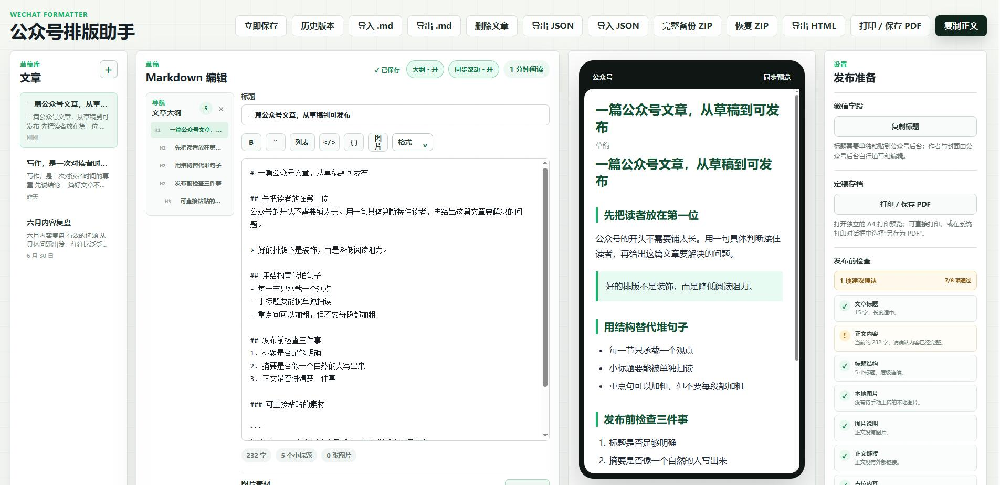

# 公众号排版助手

一个面向微信公众号后台的 Markdown 排版与发布辅助工具。它帮助你编辑文章、预览排版、复制富文本正文，并将文章库保存在当前浏览器中。当前正式版本为 **v0.2.0**。

纯前端 `Vite + React + TypeScript` 应用，数据仅存储在浏览器中。

👉 在线体验：https://wechat-article-formatter.lxw112190.workers.dev

Author: 天天代码码天天 | QQ: 819069052<br>
QQ Group: C# 人工智能实践 | 群号: 758616458

## 功能

- CommonMark + GFM Markdown 解析，支持六级标题、嵌套列表、任务列表、表格、删除线、代码、自动链接、HTML 块等标准语法。
- Markdown 编辑、手机预览和富文本正文复制，编辑区与预览区可开启或关闭双向同步滚动。
- 文章大纲导航：大纲位于 Markdown 编辑器左侧并可手动折叠，窄屏时显示为覆盖式面板；实时识别 ATX 与 Setext 标题并忽略代码块内容，点击后同时定位编辑区与手机预览。
- 发布前检查：实时检查标题、正文长度、标题层级、本地图片素材、图片说明、HTTP/空链接、草稿占位词、表格和复杂 HTML；存在严重问题时，复制正文前会再次确认。
- Word / 网页内容粘贴清理：自动移除冗余样式与危险标签，并把标题、列表、表格、链接和常用文字样式转换为 Markdown；无法直接复用的本地图片会提示重新上传。
- 本地图片素材：支持粘贴、拖拽或选择 JPG、PNG、WebP、GIF，自动按最长 1280px 压缩并保存到 IndexedDB，可预览、填写图片说明、重新插入、下载、节省空间、替换和删除。
- 本地图片在 Markdown 中使用 `asset://图片ID`，复制正文和导出 HTML 时只输出图片 ID 占位块，不嵌入 Base64；粘贴到公众号后台后需按 ID 上传压缩图片并删除占位块。
- 标题单独复制，适配微信公众号后台的标题输入框。
- 常用格式快捷键，以及覆盖文字、六级标题、引用、列表、任务、链接、图片、表格、代码、分隔线、换行和 HTML 块的完整格式菜单。
- 7 套内置主题，并支持真正的自定义主题：可调整完整配色、微软雅黑等 10 类字体、正文节奏、H1～H6 独立样式、列表、强调文字、链接、引用、代码块、表格、图片说明、分隔线和圆角。
- 自定义主题可保存到浏览器，也可作为独立 `.wechat-theme.json` 文件导入、导出和分享；预览、复制正文、导出 HTML 与打印 PDF 使用同一套样式。
- 文章库：新建、切换、自动保存、未保存提醒、历史版本恢复和删除文章。
- 单篇 `.md` / `.markdown` 文件导入与导出；导入会创建新文章，不覆盖已有文章。
- 完整 ZIP 备份与恢复：同时保存文章、历史版本、设置、自定义主题和 IndexedDB 图片；V3 清单对每个文件记录 SHA-256，并校验压缩包、解压内容、单文件和条目数量上限。
- JSON 导出和导入继续保留，用于只包含文章文本的轻量兼容备份。
- 导出完整 HTML 文件，文件包含文章标题和正文。
- 打印 / 保存 PDF：生成独立的 A4 打印预览，保留当前主题、表格和预览图片，可用于定稿存档、审核、打印或另存为 PDF。

## 快速开始

安装依赖：

```bash
npm install
```

启动开发服务器：

```bash
npm run dev
```

浏览器打开终端显示的地址，默认是 `http://localhost:5173`。

## 常用命令

```bash
npm run dev          # 本地开发
npm run build        # 类型检查并生成生产构建到 dist
npm run preview      # 预览生产构建
npm run typecheck    # TypeScript 类型检查
npm run lint         # ESLint 代码质量检查
npm run lint:fix     # 自动修复可修复的 ESLint 问题
npm run format       # 使用 Prettier 格式化项目
npm run format:check # 检查格式但不修改文件
npm run test         # 运行 Vitest 单元测试
npm run check        # 执行全部质量检查和构建
```

> **Windows PowerShell 用户**：若提示 `npm.ps1` 被执行策略阻止，将 `npm` 替换为 `npm.cmd` 即可。

## 文章库与备份

文章库使用浏览器的 `localStorage` 保存，数据只保留在当前浏览器和当前设备中。清理浏览器站点数据、使用无痕窗口或更换浏览器，都可能导致文章库不可见。

建议定期点击“完整备份 ZIP”。ZIP 中包含 `manifest.json`、文章库、历史版本、设置、自定义主题、每篇文章的 Markdown 文件和全部图片，可用于跨浏览器、跨设备完整迁移。恢复前会检查备份标识、格式版本、文件数量、路径和容量；V3 备份还会校验逐文件 SHA-256。v0.1 产生的 V2 备份仍可恢复，高于当前应用支持版本的备份不会被强行导入。

恢复完整 ZIP 会替换当前文章库、历史版本、设置、自定义主题和图片素材。应用会先读取并校验整个备份；若写入浏览器存储失败，会显示 IndexedDB、权限或存储空间不足等具体提示，并尽量回滚到恢复前的图片数据。

JSON 和单篇 `.md` 文件不包含图片二进制，仅适合轻量导出或兼容旧版本。完整 ZIP、JSON 都可能包含未公开文章，请妥善保存，不要提交到公开 GitHub 仓库。

## 自定义主题与分享

在“发布准备 → 排版主题”中选择一个内置或自定义主题：

1. 点击“基于当前创建”或“复制为新主题”，打开主题编辑器。
2. 在“基础设置”中调整配色、微软雅黑/苹方/思源字体、正文尺寸和常用内容块。
3. 在“高级设置”中分别配置 H1～H6 的字号、颜色、对齐与装饰，以及正文缩进、列表、粗体、链接和图片说明。
4. 使用右侧“手机 / 桌面”切换检查不同内容宽度；编辑过程中可以撤销、重做或恢复到打开时的状态。
5. 点击“保存并使用”，主题会保存在当前浏览器，并立即用于手机预览、复制正文、HTML 和 PDF。
6. 点击“导出当前”，得到独立的 `.wechat-theme.json` 文件；将该文件发给别人，对方点击“导入主题”即可使用。
7. 内置主题不会被直接修改；编辑内置主题时会自动创建自定义副本。自定义主题可继续编辑或删除。

主题文件只包含经过校验的排版参数，不包含文章、图片或任意 CSS/脚本。主题文件格式已升级为 V2，并兼容导入 V1 文件；完整 ZIP 备份会自动携带全部自定义主题。

## 公众号发布流程

1. 在工具中创建或打开文章，编辑 Markdown 内容。
2. 内容停止输入后会自动保存；也可以点击“立即保存”立刻保存。
3. 点击“复制标题”，粘贴到微信公众号后台的标题输入框。
4. 点击“复制正文”，粘贴到微信公众号编辑器。
5. 如果正文含本地图片，在“图片素材”区域下载压缩图片，按正文中的图片 ID 在公众号后台上传并删除占位块。
6. 在微信公众号后台自行填写作者、封面和其他发布设置。

当前版本不直接调用微信公众号接口，也不会自动发布文章。

## 打印与保存 PDF

点击顶部或“发布准备”面板中的“打印 / 保存 PDF”，工具会打开独立的 A4 打印预览。确认内容和分页后，再次点击“打印 / 保存 PDF”：

1. 需要纸质文件时，选择实际打印机。
2. 需要 PDF 文件时，在系统打印对话框中选择“另存为 PDF”或“Microsoft Print to PDF”。
3. 建议开启“背景图形”，以完整保留主题色、引用块和表格底色。

打印版本会使用当前排版主题和本地图片预览，不会把 Base64 图片写入文章或备份文件。浏览器可能会拦截打印预览窗口，遇到提示时请允许本站打开弹出窗口。

## 技术栈

- Vite
- React
- TypeScript
- Marked（CommonMark / GFM 解析）
- DOMPurify（HTML 安全清理）
- JSZip（版本化完整备份与恢复）
- IndexedDB（本地图片 Blob 存储）
- Vitest（纯函数单元测试）
- ESLint + Prettier（代码质量与格式）
- 模块化原生 CSS
- Browser `localStorage`

## 截图



## 赞助

如果这个项目对你有帮助，欢迎使用微信赞助支持项目持续维护与改进。


## License

MIT
