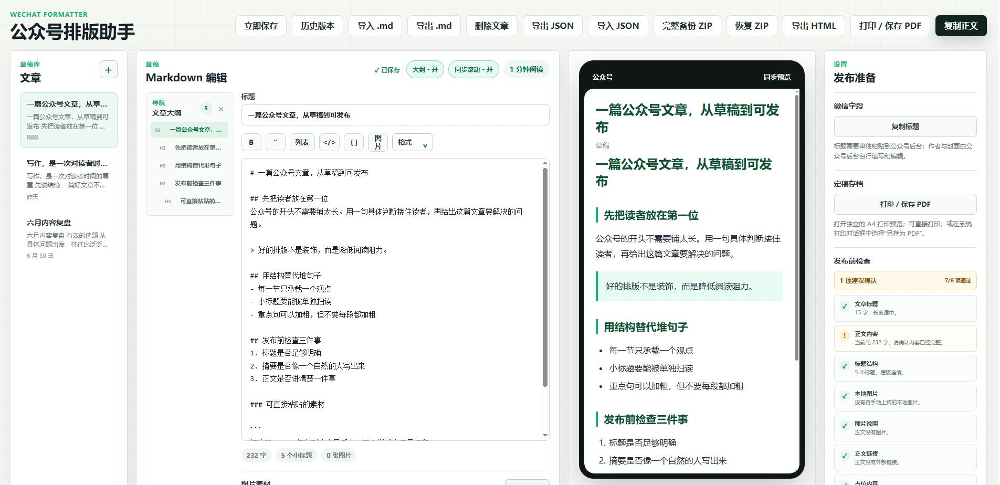

# 公众号排版助手

一个面向微信公众号后台的 Markdown 排版与发布辅助工具。它帮助你编辑文章、预览排版、复制富文本正文，并将文章库保存在当前浏览器中。当前正式版本为 **v0.5.0**。

纯前端 `Vite + React + TypeScript` 应用，数据仅存储在浏览器中。

👉 在线体验：https://wechat-article-formatter.lxw112190.workers.dev

👉 桌面应用打包：[lw.Web2App](https://github.com/lxw112190/lw.Web2App)

Author: 天天代码码天天 | QQ: 819069052<br>
QQ Group: C# 人工智能实践 | 群号: 758616458

## 功能

- CommonMark + GFM Markdown 解析，支持六级标题、嵌套列表、任务列表、表格、删除线、代码、自动链接、HTML 块等标准语法。
- Markdown 编辑、手机预览和富文本正文复制，编辑区与预览区可开启或关闭双向同步滚动。
- 文章大纲导航：大纲位于 Markdown 编辑器左侧并可手动折叠，窄屏时显示为覆盖式面板；实时识别 ATX 与 Setext 标题并忽略代码块内容，点击后同时定位编辑区与手机预览。
- 发布前检查：实时检查标题、正文长度、标题层级、本地图片素材、图片说明、HTTP/空链接、草稿占位词、表格和复杂 HTML；存在严重问题时，复制正文前会再次确认。
- Word / 网页内容粘贴清理：自动移除冗余样式与危险标签，并把标题、列表、表格、链接和常用文字样式转换为 Markdown；无法直接复用的本地图片会提示重新上传。
- 本地图片素材：支持粘贴、拖拽或选择 JPG、PNG、WebP、GIF，自动按最长 1280px 压缩并保存到 IndexedDB，可预览、填写图片说明、重新插入、下载、节省空间、替换和删除。
- 本地图片在 Markdown 中使用 `asset://图片ID`，复制正文和导出 HTML 时只输出图片 ID 占位块，不嵌入 Base64；粘贴到公众号后台后需按 ID 上传压缩图片并删除占位块。
- 标题单独复制，适配微信公众号后台的标题输入框。
- 常用格式快捷键，以及覆盖文字、六级标题、引用、列表、任务、链接、图片、表格、代码、分隔线、换行和 HTML 块的完整格式菜单。
- 7 套内置主题，并支持真正的自定义主题：可调整完整配色、微软雅黑等 10 类字体、正文节奏、H1～H6 独立样式、列表、强调文字、链接、引用、代码块、表格、图片说明、分隔线和圆角。
- 自定义主题可保存到浏览器，也可作为独立 `.wechat-theme.json` 文件导入、导出和分享；预览、复制正文、导出 HTML 与打印 PDF 使用同一套样式。
- 文章库：新建、切换、自动保存、未保存提醒、历史版本恢复和删除文章。
- 草稿库支持按标题与正文搜索、更新时间/标题排序、置顶和复制文章；删除文章先进入回收站，可恢复或彻底删除。
- 本地数据采用版本化结构保存；检测到文章库或历史数据损坏时，会保留原始副本并暂停覆盖，可下载原始数据、尝试修复或重新开始。
- 存储空间中心显示文章、历史、回收站、图片与浏览器配额，支持申请持久化存储并安全清理未使用图片。
- 单篇 `.md` / `.markdown` 文件导入与导出；导入会创建新文章，不覆盖已有文章。
- 完整 ZIP 备份与恢复：同时保存文章、回收站、历史版本、设置、自定义主题和 IndexedDB 图片；V5 会携带 Word 导出偏好，清单对每个文件记录 SHA-256，并校验压缩包、解压内容、单文件和条目数量上限。
- JSON 导出和导入继续保留，用于只包含文章文本的轻量兼容备份。
- 导出完整 HTML 文件，文件包含文章标题和正文。
- 打印 / 保存 PDF：生成独立的 A4 打印预览，保留当前主题、表格和预览图片，可用于定稿存档、审核、打印或另存为 PDF。
  - 导出真正的 Word `.docx` 文件：保留标题、正文、强调、代码、列表、表格、图片和可点击超链接；图片无法读取时自动生成文字说明，不会导致整个导出失败。
  - 导出 Word 兼容 HTML：复用当前主题与页面设置，外观更接近网页预览和 PDF；可用 Word/WPS 打开后另存为 `.docx`。
- 微信公众号复制兼容：公众号文章链接保持标准链接交给微信识别；普通外链、HTTP 链接和邮箱链接复制时保留可见 URL；任务列表转换为 `☑ / ☐`，多级列表复制时保持内容顺序。

## 桌面应用与 lw.Web2App

本项目是纯前端 Web 应用，同时也是 [lw.Web2App](https://github.com/lxw112190/lw.Web2App) 的 CI 集成测试项目。

lw.Web2App 是一个轻量级跨平台网页桌面应用打包工具，可以将 HTML、Vue、React、Vite 等静态项目打包为单文件桌面应用。目前稳定支持 Windows 10/11 x64，并提供 Ubuntu 22.04/24.04 x86_64 Beta；Windows 使用 WebView2，Linux 使用 WebKitGTK。

lw.Web2App 的 CI 会自动检出本项目，执行 `npm ci` 和 `npm run build` 生成 `dist`，再将其打包为 Windows EXE 或 Linux 可执行文件，并检查 Payload 完整性、静态资源、SPA fallback 和启动流程。因此，本项目也是 lw.Web2App 持续验证真实 React/Vite 应用兼容性的示例。

开发者可以在 Windows 本地完成打包：

```powershell
npm ci
npm run build

lw.Web2App.exe pack .\dist .\公众号排版助手.exe `
  --title "公众号排版助手" `
  --company "天天代码码天天" `
  --version 0.5.0.0 `
  --windowed
```

> 当前仓库尚未在 Release 中正式分发桌面版，上述内容用于说明自行打包方法和两个项目的集成测试关系。网页版、Windows WebView2 和 Linux WebKitGTK 使用不同的本地存储环境，数据不会自动同步；跨环境迁移前，请先导出“完整备份 ZIP”，再在目标环境中恢复。

## 快速开始

安装依赖：

```bash
npm install
```

启动开发服务器：

```bash
npm run dev
```

浏览器打开终端显示的地址，默认是 `http://localhost:3000`。

## 常用命令

```bash
npm run dev          # 本地开发
npm run build        # 类型检查并生成生产构建到 dist
npm run preview      # 预览生产构建
npm run typecheck    # TypeScript 类型检查
npm run lint         # ESLint 代码质量检查
npm run lint:fix     # 自动修复可修复的 ESLint 问题
npm run format       # 使用 Prettier 格式化项目
npm run format:check # 检查格式但不修改文件
npm run test         # 运行 Vitest 单元测试
npm run test:e2e     # 运行 Playwright Chromium 端到端测试
npm run check        # 执行全部质量检查和构建
```

> **Windows PowerShell 用户**：若提示 `npm.ps1` 被执行策略阻止，将 `npm` 替换为 `npm.cmd` 即可。

## 文章库与备份

文章库使用浏览器的 `localStorage` 保存，数据只保留在当前浏览器和当前设备中。清理浏览器站点数据、使用无痕窗口或更换浏览器，都可能导致文章库不可见。

建议定期点击“完整备份 ZIP”。ZIP 中包含 `manifest.json`、文章库、回收站、历史版本、设置、自定义主题、Word 导出偏好、每篇文章的 Markdown 文件和全部图片，可用于跨浏览器、跨设备完整迁移。恢复前会检查备份标识、格式版本、文件数量、路径和容量；V3～V5 备份都会校验逐文件 SHA-256。v0.1 产生的 V2 备份仍可恢复，高于当前应用支持版本的备份不会被强行导入。

恢复完整 ZIP 会替换当前文章库、回收站、历史版本、设置、自定义主题和图片素材。应用会先读取并校验整个备份；若写入浏览器存储失败，会显示 IndexedDB、权限或存储空间不足等具体提示，并尝试回滚文章、回收站、历史、主题、设置和图片数据。

“存储空间”可以查看当前浏览器的站点数据占用，并申请持久化存储。浏览器是否授予持久化由其自身策略决定；无论是否授予，都应继续定期导出完整 ZIP 备份。

JSON 和单篇 `.md` 文件不包含图片二进制，仅适合轻量导出或兼容旧版本。完整 ZIP、JSON 都可能包含未公开文章，请妥善保存，不要提交到公开 GitHub 仓库。

## 自定义主题与分享

在“发布准备 → 排版主题”中选择一个内置或自定义主题：

1. 点击“基于当前创建”或“复制为新主题”，打开主题编辑器。
2. 在“基础设置”中调整配色、微软雅黑/苹方/思源字体、正文尺寸和常用内容块。
3. 在“高级设置”中分别配置 H1～H6 的字号、颜色、对齐与装饰，以及正文缩进、列表、粗体、链接和图片说明。
4. 使用右侧“手机 / 桌面”切换检查不同内容宽度；编辑过程中可以撤销、重做或恢复到打开时的状态。
5. 点击“保存并使用”，主题会保存在当前浏览器，并立即用于手机预览、复制正文、HTML 和 PDF。
6. 点击“导出当前”，得到独立的 `.wechat-theme.json` 文件；将该文件发给别人，对方点击“导入主题”即可使用。
7. 内置主题不会被直接修改；编辑内置主题时会自动创建自定义副本。自定义主题可继续编辑或删除。

主题文件只包含经过校验的排版参数，不包含文章、图片或任意 CSS/脚本。主题文件格式已升级为 V2，并兼容导入 V1 文件；完整 ZIP 备份会自动携带全部自定义主题。

## 公众号发布流程

1. 在工具中创建或打开文章，编辑 Markdown 内容。
2. 内容停止输入后会自动保存；也可以点击“立即保存”立刻保存。
3. 点击“复制标题”，粘贴到微信公众号后台的标题输入框。
4. 点击“复制正文”，粘贴到微信公众号编辑器。
5. 如果正文含本地图片，在“图片素材”区域下载压缩图片，按正文中的图片 ID 在公众号后台上传并删除占位块。
6. 在微信公众号后台自行填写作者、封面和其他发布设置。

当前版本不直接调用微信公众号接口，也不会自动发布文章。

## 打印与保存 PDF

点击顶部或“发布准备”面板中的“打印 / 保存 PDF”，工具会打开独立的 A4 打印预览。确认内容和分页后，再次点击“打印 / 保存 PDF”：

1. 需要纸质文件时，选择实际打印机。
2. 需要 PDF 文件时，在系统打印对话框中选择“另存为 PDF”或“Microsoft Print to PDF”。
3. 建议开启“背景图形”，以完整保留主题色、引用块和表格底色。

打印版本会使用当前排版主题，并临时读取本地图片用于预览；不会把图片以 Base64 写入 Markdown 正文，完整 ZIP 备份仍会单独保存图片二进制。浏览器可能会拦截打印预览窗口，遇到提示时请允许本站打开弹出窗口。

## Word 导出

点击顶部或“发布准备 → 定稿存档”中的“导出 Word”，工具会在浏览器中生成真正的 `.docx` 文件。导出内容来自当前排版预览，支持标题、段落、粗体、斜体、删除线、代码、引用、列表、任务列表、表格、图片和可点击超链接。

设置窗口中的“导出 Word 兼容 HTML”会生成独立的 `.html` 文件，自动嵌入可读取的图片；其 CSS 与当前预览、PDF 共用主题参数，因此颜色、标题、引用、代码和表格外观更接近。请用 Word 或 WPS 打开该文件，再选择“另存为 `.docx`”；它不是伪装扩展名的 `.doc` 文件，因此不会触发格式不匹配提示。

导出前可以选择“公众号定稿”“正式报告”或“紧凑打印”模板，也可以调整 A4/A5 纸张、页边距、字体、字号、行距、图片宽度、主标题、页脚和页码。设置会保存在当前浏览器，下次继续使用。

长文章可以生成 H1～H3 可点击目录；正文开头与文章标题相同的 H1 会自动去重。表格支持合并单元格、自动列宽和跨页重复表头，长链接会增加不影响点击的换行机会。

本地图片会尝试嵌入 Word；远程图片会尝试读取后嵌入，WebP 和 SVG 会自动转换为 Word 兼容的 PNG。单张图片读取或转换失败时，会保留图片说明和原图地址，不会阻止整篇 Word 生成。Word 导出不会使用微信公众号的外链降级规则，普通外链和公众号文章链接在 Word 中都保持可点击。

## 微信公众号链接兼容

复制正文时，微信公众号文章链接保留标准 HTML 链接，由微信后台自行识别和规范化，不主动伪造微信私有属性。

普通外链、HTTP 链接和邮箱链接会转换为可见的“文字（URL）”，避免微信过滤 `<a>` 后地址丢失；如果链接文字本身就是 URL，则不会重复输出。GFM 任务列表会转换为 `☑ / ☐`，多级嵌套列表会转换为稳定的缩进块，优先保证内容顺序不被微信重排。HTML 导出和 Word 导出不受这些微信公众号专用降级规则影响。

## 技术栈

- Vite
- React
- TypeScript
- Marked（CommonMark / GFM 解析）
- DOMPurify（HTML 安全清理）
- JSZip（版本化完整备份与恢复）
- IndexedDB（本地图片 Blob 存储）
- Vitest（纯函数单元测试）
- Playwright（核心用户流程端到端测试）
- [lw.Web2App](https://github.com/lxw112190/lw.Web2App)（Windows/Linux 桌面应用打包与 CI 集成测试）
- ESLint + Prettier（代码质量与格式）
- 模块化原生 CSS
- Browser `localStorage`

## 截图



## 赞助

如果这个项目对你有帮助，欢迎使用微信赞助支持项目持续维护与改进。


## License

MIT
